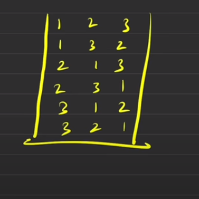
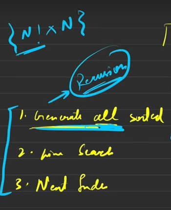
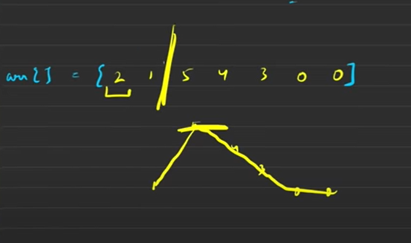

1. See detailed notes [here](https://takeuforward.org/data-structure/next_permutation-find-next-lexicographically-greater-permutation/).
1. Permutation means `all possible ways in which an array can be arranged`.
2. Here we have to find the next `lexographical` permutation.
3. For example, if we are given [3,1,2] we will have to return [3,2,1]
   

## Brute force solution 
1. The brute force solution would be 
   
   

   1. Generate all permutations (using recursion) and sort them

   2. Do a linear search and find the next permutation and return it

   3. but this will have `awful` time complexity! i.e. `N! * N`

   4. Thus we will try to devise a better approach. 
   
   5. Also in recusion, the left side of the tree get evaluated first.


# STL solution

1. You can simply use the `next_permutation()` STL function that'll return you the next permutation and then return the vector.
2. Now of course the interviewer will not accept this and ask you to actually implement it instead of using an inbuild function but still you should tell him about this function and later implement it in order to display your command over STL.
3. The C++ code is given below
   ```cpp
    class Solution {
        public:
    void nextPermutation(vector<int>& nums) {
        next_permutation(nums.begin(),nums.end());
        }
    };

   ```

## Optimized Solution

1. Find the breakpoint, whenever `a[i]<a[i+1]`
2. Here you see that the breakpoint occurs after 1, i.e. after 1 you can find numbers (3,4,5) which are greater than it.
   
   

3. The 2nd part of the algo should be to select the number which is `>a[i]` but smallest of all the numbers possible
4. In the example above, 3,4 and 5 are greater than 1 but we will select the number which is the smallest i.e. 3 but its still `>a[i]`
5. The remaining elements should be filled in a sorted order, 

6. For example: Here we have selected `3` to be replaced by `1`, The current arrangement of elements looks like
`2,3` while the remaining elements are `1,5,4,0,0`
7. Now these elements will be sorted and put in the vector like this `0,0,1,4,5`
8. The final form of the vector would be `2,3,0,0,1,4,5`