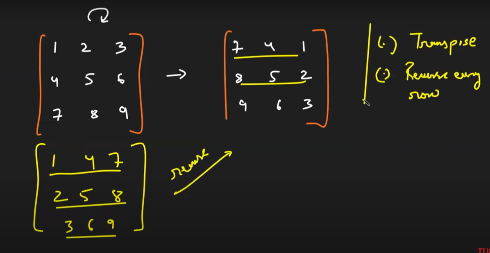

<h2><a href="https://leetcode.com/problems/rotate-image/">48. Rotate Image</a></h2><h3>Medium</h3><hr><div><p>You are given an <code>n x n</code> 2D <code>matrix</code> representing an image, rotate the image by <strong>90</strong> degrees (clockwise).</p>

<p>You have to rotate the image <a href="https://en.wikipedia.org/wiki/In-place_algorithm" target="_blank"><strong>in-place</strong></a>, which means you have to modify the input 2D matrix directly. <strong>DO NOT</strong> allocate another 2D matrix and do the rotation.</p>

<p>&nbsp;</p>
<p><strong class="example">Example 1:</strong></p>

<pre><strong>Input:</strong> matrix = [[1,2,3],[4,5,6],[7,8,9]]
<strong>Output:</strong> [[7,4,1],[8,5,2],[9,6,3]]
</pre>

<p><strong class="example">Example 2:</strong></p>

<pre><strong>Input:</strong> matrix = [[5,1,9,11],[2,4,8,10],[13,3,6,7],[15,14,12,16]]
<strong>Output:</strong> [[15,13,2,5],[14,3,4,1],[12,6,8,9],[16,7,10,11]]
</pre>

<p>&nbsp;</p>
<p><strong>Constraints:</strong></p>

<ul>
	<li><code>n == matrix.length == matrix[i].length</code></li>
	<li><code>1 &lt;= n &lt;= 20</code></li>
	<li><code>-1000 &lt;= matrix[i][j] &lt;= 1000</code></li>
</ul>
</div>

# Notes
## Brute force solution

1. You can take another matrix and put the rows of the first matrix in the columns of the second matrix, by the you are done the matrix would've been rotated clockwise
2. but this approach is not optimal and would be rejected.

## Optimal Approach

1. First we will perform the transpose of a matrix
2. Then we will reverse each row
3. The end result will be that our matrix would be rotated 90 degree clockwise
   

4. The time complexity would be `O(N^2)` [for transpose] and `O(N^2)` [for reversal of all rows]

5. The code of the algorithm is given below
    ```py

    class Solution:
    def rotate(self, matrix: List[List[int]]) -> None:
        
        # Taking transpose of a the matrix
        for i in range(len(matrix)):
            for j in range (0,i):
                matrix[i][j],matrix[j][i] = matrix[j][i],matrix[i][j]
                
        # Now reversing each row
        
        for i in range(len(matrix)):
            matrix[i]=matrix[i][::-1]
        
    ```