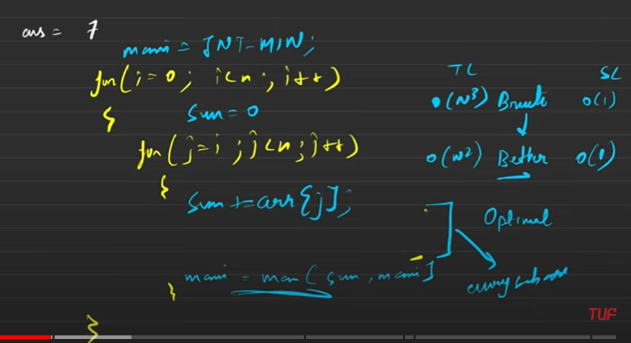
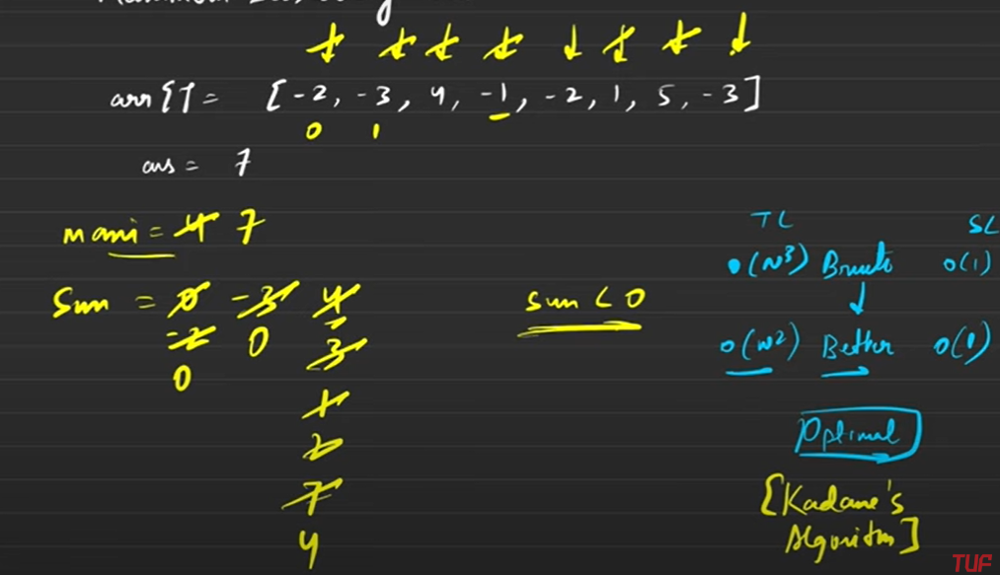

<h2><a href="https://leetcode.com/problems/maximum-subarray/">53. Maximum Subarray</a></h2><h3>Medium</h3>

Given an integer array <code>nums</code>, find the subarray with the largest sum, and return <em>its sum</em>.

&nbsp;

<strong class="example">Example 1:</strong>

<pre><strong>Input:</strong> nums = [-2,1,-3,4,-1,2,1,-5,4]
<strong>Output:</strong> 6
<strong>Explanation:</strong> The subarray [4,-1,2,1] has the largest sum 6.
</pre>

<strong class="example">Example 2:</strong>

<pre><strong>Input:</strong> nums = [1]
<strong>Output:</strong> 1
<strong>Explanation:</strong> The subarray [1] has the largest sum 1.
</pre>

<strong class="example">Example 3:</strong>

<pre><strong>Input:</strong> nums = [5,4,-1,7,8]
<strong>Output:</strong> 23
<strong>Explanation:</strong> The subarray [5,4,-1,7,8] has the largest sum 23.
</pre>

&nbsp;

<strong>Constraints:</strong>

<ul>
	<li><code>1 &lt;= nums.length &lt;= 105</code></li>
	<li><code>-104 &lt;= nums[i] &lt;= 104</code></li>
</ul>

&nbsp;

<strong>Follow up:</strong> If you have figured out the <code>O(n)</code> solution, try coding another solution using the <strong>divide and conquer</strong> approach, which is more subtle.

## Brute force approach
1. Generate all sub arrays.
2. create a variable `sum=0`.
3. Create a `max_sum` variable that stores the minimum integer value at the start of the loop.
4. Inside the second loop, run a third for loop since you know that the current sub array will go form `i -> j`.
5. Once the for loop is complete take the max of the local sum and the max sum and store it in max_sum variable.
6. But this solution will have `O(n^3)` time complexity which has to be optimized. 

## Better Approach

1. In this approach we remove the innermost loop since we can always use the sum of the pervious sub-array in each itertion of `i-th` loop.
2. and you just add the sum of the previous sub-array in it and use it to compare `max_sum=max(max_sum,sum)`.
3. The complexity of this approach would still be `O(N^2)` which is less than ideal.

## Optimal Approach

1. The most optimal solution would be used using the `Kadane's algorithm`.
2. The `max_sum` shall be made equal to `INT_MIN`.
3. In the first iteration will will take `max_sum=max(max_sum,arr[i])`
4. If the element is < 0 we will always reduce our sum to 0 and then move forward since taking forward a -ve number doesn't make sense.
5. In this example, we take -2 compare it to INT_MIN and take it, then we reduce sum to 0, then we take -3 but the `max_sum` remains -2 and the sum is reduced to 0 because of the overall -ve addition to the sum, then we take 4 and the sum becomes 4 and `max_sum` also becomes 4.
6. Then we add -1 to the sum but we still take it forward because the overall sum would still be 3 which is >0.
7. Then we take -2 the sum becomes 1 but we still take it forward because the overall sum would still be >0 i.e. 1
8. Now when we add 1 our sum becomes 2 but the max_sum still remains 4.
9. After that we add 5 to the sum now our sum becomes 7 and the `max_sum` also becomes 7.
10. This was the reason of carrying all those negative values from -1,-2 etc since the overall sum of the subarray was still >0 hence a +ve addition in the sum.. 

