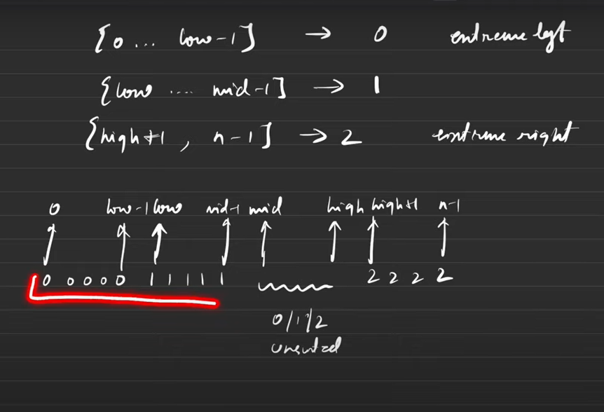
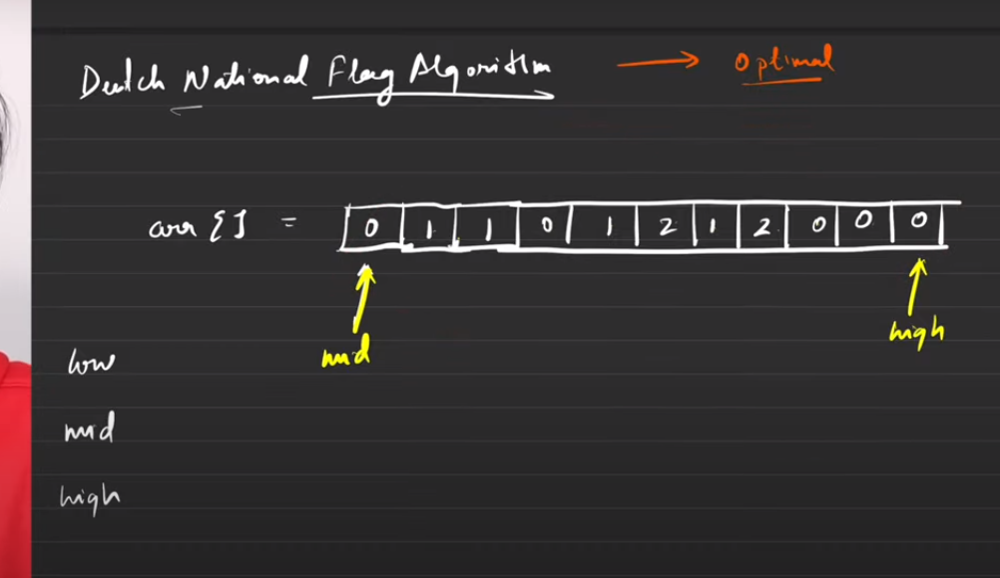

<h2><a href="https://leetcode.com/problems/sort-colors/">75. Sort Colors</a></h2><h3>Medium</h3><hr><div><p>Given an array <code>nums</code> with <code>n</code> objects colored red, white, or blue, sort them <strong><a href="https://en.wikipedia.org/wiki/In-place_algorithm" target="_blank">in-place</a> </strong>so that objects of the same color are adjacent, with the colors in the order red, white, and blue.</p>

<p>We will use the integers <code>0</code>, <code>1</code>, and <code>2</code> to represent the color red, white, and blue, respectively.</p>

<p>You must solve this problem without using the library's sort function.</p>

<p>&nbsp;</p>
<p><strong class="example">Example 1:</strong></p>

<pre><strong>Input:</strong> nums = [2,0,2,1,1,0]
<strong>Output:</strong> [0,0,1,1,2,2]
</pre>

<p><strong class="example">Example 2:</strong></p>

<pre><strong>Input:</strong> nums = [2,0,1]
<strong>Output:</strong> [0,1,2]
</pre>

<p>&nbsp;</p>
<p><strong>Constraints:</strong></p>

<ul>
	<li><code>n == nums.length</code></li>
	<li><code>1 &lt;= n &lt;= 300</code></li>
	<li><code>nums[i]</code> is either <code>0</code>, <code>1</code>, or <code>2</code>.</li>
</ul>

<p>&nbsp;</p>
<p><strong>Follow up:</strong>&nbsp;Could you come up with a one-pass algorithm using only&nbsp;constant extra space?</p>
</div>

# Notes


# Brute force solution

1. 2-pass (Count sort approach Pretty simple)
2. The time complexity will be `O(N)+O(N)=O(N)`


```cpp

class Solution {
public:
    void sortColors(vector<int>& nums) {
        int count_0=0, count_1=0, count_2=0;
        for(int i=0;i<nums.size();i++)
        {
            if(nums[i]==0)
                count_0++;
            else if(nums[i]==1)
                count_1++;
            else
                count_2++;
        }
        
        // cout<<count_0<<count_1<<count_2<<endl;
        for(int i=0;i<count_0;i++)
            nums[i]=0;
        
        
        for(int i=count_0;i<count_1+count_0;i++)
            nums[i]=1;
        
        for(int i=count_1+count_0;i<count_2+count_1+count_0;i++)
            nums[i]=2;
    }
};

```

# Optimal Solution

1. In this algo we further reduce the complexity form `O(2N)` to `O(N)` using the `Dutch National Flag algorithm`.
2. The algo uses 3 pointers, low, mid and high.

3. In this algo we work on the following principles
   1. 0 to low-1 will be filled with zeros
   2. low to mid-1 will be filled with 1
   3. high+1 to n-1 will be filled with 2
   4. mid to high will be filled with random numbers.   
   5. Portions mentioned in point 1,2 and 3 are already sorted, if we can somehow solve portion number 4 then our whole array will become sorted.
    

4. At the start of the algo, `mid` will be pointing at the start of the array and `high` will be pointing at the end of the array, because the entire array is unsorted.
    

5. The low pointer can be put at the `0th position` since its the starting index.
6. We design our algo in terms of `arr[mid]`, there are three possible cases
      1. arr[mid]==0
      2. arr[mid]==1
      3. arr[mid]==2
   1. In the case of arr[mid]==0 we will `swap(arr[mid],arr[low])`, because we know that till low-1 all be already zeros.
   2. consequently the low will also move ahead one step (low++) because `low` must start from 1s.
   3. The `mid` pointer will also move ahead 1 position (mid++) because the fist elements has now been swaped and its sorted.
   4. In the case of arr[mid]==1 we will not do anything since its already at its rightful place, just move the mid pointer by 1 position (mid++).
   5.  In the case of arr[mid]==2, we will swap the element at the mid position with the element at the high position. `swap(arr[mid],arr[high])` and reduce high by 1 (high--)
7. Using the analogies above we can say 
   1. 
    ```python
        if(arr[mid]==0):
            swap(arr[mid],arr[low])
            low++
            mid++
    ```
    2. 
    ```python
        if(arr[mid]==1):
            mid++
    
    ```
    3. 
    ```python
        if(arr[high]==2):
            swap(arr[high],arr[mid])
            high--
    ```

8. The python code for the problem is given by:
   ```python
	class Solution:
		def sortColors(self, nums: List[int]) -> None:
			low=0;
			mid=0;
			high=len(nums)-1;
			for i in range(mid,len(nums)):
				if(mid > high):
					break
				if(nums[mid] == 0):
					nums[low],nums[mid] = nums[mid],nums[low]
					mid+=1
					low+=1
					# print("first block")
					# print("Iteration",i,nums)
					# print("low:",low," mid:",mid," high:",high," i:",i," nums[i]:",nums[i])
				elif(nums[mid] == 1):
					mid+=1
					# print("second block")
					# print("Iteration",i,nums)
					# print("low:",low," mid:",mid," high:",high," i:",i," nums[i]:",nums[i])


				elif(nums[mid] == 2):
					nums[high],nums[mid] = nums[mid],nums[high]
					high-=1
					# print("third block")
					# print("Iteration",i,nums)
					# print("low:",low," mid:",mid," high:",high," i:",i," nums[i]:",nums[i])

   ```